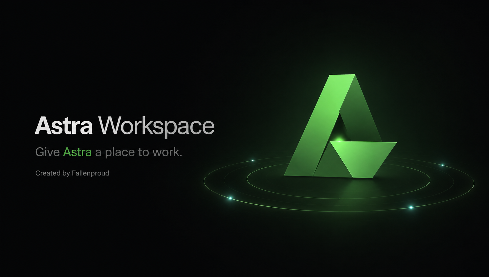
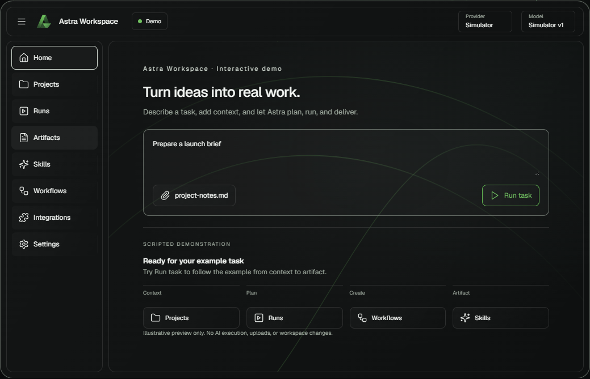
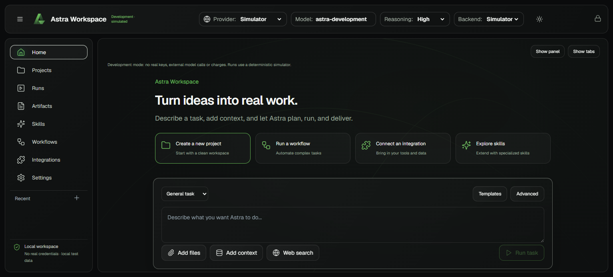
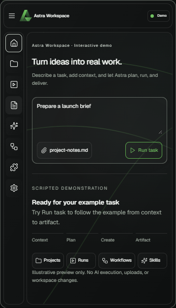
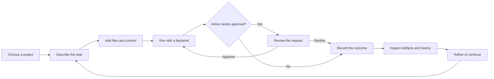
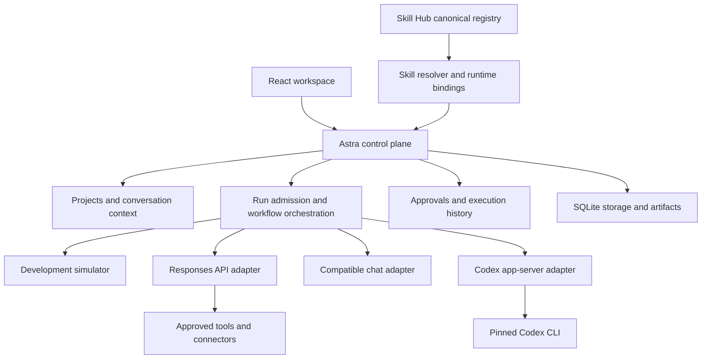

<div align="center">
  

# Astra Workspace

**AI Workspace · AI Agent Platform · Multi-Model Control Plane**

A persistent place to connect models, run tasks, use tools, and keep the work.

**Created and maintained by [Fallenproud](https://github.com/Fallenproud)**

[Get started](#get-started) · [Explore the workspace](#explore-the-workspace) · [Architecture](#architecture) · [Documentation](#documentation) · [Report an issue](https://github.com/Fallenproud/astra-workspace/issues)

</div>

---

## Welcome

Astra gives AI somewhere to **work**. Projects, conversations, files, runs, approvals, artifacts, model settings, and execution history belong to one operational environment, so a task can be inspected, improved, and continued later.

Connect a model, give Astra a task, review its actions, and keep the outcome with the project. Astra owns the control plane; execution providers work beneath it.

> **Current release: local development preview.** The default experience uses a deterministic simulator and accepts no real provider credentials. Hosted registration, team access, and a public production service are not implemented. Live-provider validation is a separate step.

## See it in action

### Interactive landing demonstration

The landing preview has eight working demo tabs and a scripted task-to-artifact sequence. It runs entirely in browser memory, without workspace API calls, uploads, or AI execution.



### Operational workspace

The separate `/workspace` application contains the actual local project, run, approval, and persistence features. In development, generated content is simulated; storage and orchestration use the real application code.



<details>
<summary><strong>See the responsive mobile demo</strong></summary>

<p align="center"></p>

</details>

## Get started

### 1. Install the prerequisites

- **Git** to clone the repository.
- **Node.js 22.13 or later**, with npm. Development has been exercised on Windows with Node 26.7.0.
- A modern browser. No API key is required for the default simulator.

### 2. Clone the project

```sh
git clone https://github.com/Fallenproud/astra-workspace.git
cd astra-workspace
```

The application files are at the repository root. Commands below run from that directory.

### 3. Install dependencies and build

```sh
npm ci
npm run build
```

### 4. Start Astra

```sh
npm start
```

Open **[http://127.0.0.1:4317](http://127.0.0.1:4317)**.

On Windows, the bundled launcher can install missing dependencies, build a missing `dist/`, and start development mode:

```powershell
.\Start-Astra.ps1
```

If an existing build is present, rebuild after pulling frontend changes. The launcher does not automatically rebuild it.

### 5. Enter the real local workspace

1. Choose **Open workspace** on the landing page.
2. Select **Open development workspace**.
3. Create a project and add a goal or relevant context.
4. Describe a task using test content, then start the run.
5. Inspect the timeline and review any requested approval.
6. Open the produced artifact and continue the conversation.
7. Reload the page to see the persisted project and history.

The landing mock is a separate demonstration. Its example artifacts and settings do not become workspace records.

### 6. Stop and return later

Press **Ctrl+C** in the server terminal. Restart with `npm start` when ready.

Saved work remains in `.data-development/`. Interrupted work is recorded as interrupted; pending side effects are not silently replayed.

## Explore the workspace

| Surface | What it is for |
| --- | --- |
| **Home** | Compose a task, add context, and continue conversations. Inspector panels and tabs remain hidden until explicitly shown. |
| **Projects** | Organize goals, decisions, files, and work. Runs retain their context snapshots. |
| **Runs** | Inspect execution events, approvals, questions, outcomes, and audit exports. |
| **Artifacts** | Review and retrieve produced files and outputs. |
| **Skills** | Inspect canonical skill definitions, resolve compatibility, and activate qualified bindings. |
| **Workflows** | Create sequential agent steps, pass bounded context, and save reusable templates. |
| **Integrations** | Manage supported provider and connector configuration in the appropriate mode. |
| **Settings** | Control model/runtime settings, reasoning, limits, and local workspace behavior. |

### The primary work loop



## Architecture

**Astra owns the product and governance. Codex is one execution backend.** Direct Responses API execution remains independent, and additional backends can be introduced through adapters.



| Layer | Implementation |
| --- | --- |
| Interface | React 19, Vite, Lucide icons, locally bundled fonts |
| Visual identity | Folded-A assets, obsidian and green surfaces, silver accents, SVG motion, lazy Three.js and GSAP |
| Control plane | Node.js and Express with explicit lifecycle and approval handling |
| Persistence | SQLite in WAL mode; files and execution state stored locally |
| Credentials | Production-only vault using scrypt-derived encryption keys and AES-256-GCM |
| Coding execution | Pinned Codex CLI `0.107.0`, behind an app-server protocol adapter |
| Extensibility | Qualified skill bindings, supported tools, workflows, and a local Node SDK |

See [ARCHITECTURE.md](ARCHITECTURE.md) for contracts, ownership, lifecycle behavior, and limits.

## Skills, agents, and diagrams

### Canonical skill source

Astra consumes [Fallenproud/skill-hub-registry](https://github.com/Fallenproud/skill-hub-registry) as the definition source. Discovery does not grant installation, trust, or execution permission.

1. Inspect the skill metadata and `SKILL.md`.
2. Resolve requirements against the current runtime.
3. Enable a qualified binding explicitly.
4. Invoke it and inspect the resulting records and artifacts.

The bundled native catalog contains 20 definitions. **Archify System Maps** has a qualified local binding; other definitions remain blocked until their dependencies and bindings are qualified. Registry refresh is read-only, revision-pinned, and hash-verified; a failed refresh preserves the previous catalog.

### Workflow execution

Workflows support **1–8 sequential steps**, assigned to reusable agents. Each step receives bounded prior context and its own run scope. Failures, cancellation, and approval decisions remain visible. Development exercises orchestration with simulated generation.

### Architecture diagrams

The vendored Archify renderer produces self-contained HTML diagrams with specifications and receipts. Astra's Mermaid adapter supports acyclic flowcharts with **2–12 nodes**, decisions, and labeled arrows; unsupported topology is rejected rather than silently simplified.

See [Archify provenance](vendor/ARCHIFY-PROVENANCE.md) and the [Astra consumer profile](profiles/astra/).

## Development and live execution

| | Default development | Explicit local production mode |
| --- | --- | --- |
| Command | `npm start` | `npm run start:production` |
| Data directory | `.data-development/` | `.data/` |
| Generation | Deterministic simulator | Selected configured provider/backend |
| Provider credentials | Rejected | Entered through the production UI and encrypted locally |
| Purpose | Build and test without real secrets or model charges | Separate, deliberate live-provider setup |

**Never use real secrets in development.** The launcher strips credential-like inherited environment variables, and the API rejects development credential mutations. Do not share one data directory between modes.

Live mode is a local execution configuration, **not a hosted deployment mode**. It requires deliberate setup and validation:

1. Stop the development server.
2. Run `npm run start:production`.
3. Configure the local vault using the production interface.
4. Add a provider and select its model/backend.
5. Validate a small task and review the effective permissions before expanding its scope.

Codex initialization/thread-start has been probed against the pinned CLI. The recorded Windows probe returned a **read-only sandbox**; writable coding and live model execution are not claimed as verified.

Browser actions use an isolated browser context with approvals, not your personal browser profile. If browser tooling requires a browser installation, use `npx playwright install chromium`. MCP support currently covers anonymous remote HTTPS endpoints through Responses; OAuth and broader connector management remain extension work.

## Persistence and recovery

- Development and production data live in separate, Git-ignored directories.
- To change the storage location, set `ASTRA_DATA_DIR` to an absolute path for the intended mode.
- Stop Astra before backing up the **entire** data directory, including SQLite/WAL files, artifacts, and histories.
- Restore the directory and use the same production passphrase. The passphrase cannot be recovered.
- Workspace JSON export excludes credentials; it does not replace a complete binary artifact/history backup.
- On restart, unfinished runs become interrupted and pending approvals expire. Continue explicitly from the saved conversation.

The current service binds to loopback and is designed for one local user. Do not expose it as a public multi-tenant service. Conversation/project content is local plaintext; provider credentials receive vault encryption.

## Project layout

```text
astra-workspace/
├── src/                      React workspace and isolated landing demo
│   ├── App.jsx               Operational workspace shell
│   ├── LandingPreview.jsx    In-memory marketing demonstration
│   └── landing-demo-script.js Canonical demo fixture and timeline
├── server/                   API, engine, adapters, vault, persistence
├── config/                   Pinned registry and workflow configuration
├── profiles/astra/           Skill consumer policy and runtime bindings
├── sdk/                      Local programmatic client
├── public/                   Canonical logos, splash assets, manifest
├── vendor/                   Pinned Archify source and notices
├── test/                     Runtime and policy tests
├── scripts/                  Launchers, verification, browser checks
├── docs/                     Contracts, acceptance notes, README assets
├── design/                   Visual evidence and screenshots
└── astra-brand-pack/          Identity system and handoff assets
```

## Validation and troubleshooting

```sh
npm run build
npm test
```

With the local server running, the current landing acceptance script is:

```sh
node scripts/landing-final-qa.mjs
```

That browser script expects installed Chrome and verifies the isolated demo, responsive containment, reduced motion, and absence of workspace API requests. Historical polish scripts may target earlier UI controls.

The landing build and browser acceptance checks passed during development. The latest extra runtime test rerun stalled after a local Vite port conflict; **do not interpret this README as a fresh all-tests-passing or CI badge**. Review [the acceptance checklist](docs/LANDING-PAGE-ACCEPTANCE.md) for evidence and deferred checks.

| Symptom | Next step |
| --- | --- |
| Local page is unavailable | Start the server from the repository root and open port 4317. |
| UI looks older after pulling | Run `npm run build`, restart if needed, and reload. |
| npm fails on this Windows host's PATH | Use `node scripts/npm.mjs ci` and the bundled launcher. |
| Port is already in use | Stop the other Astra process, or set `PORT` to another local port. |
| A test stalls with a Vite port conflict | Run tests without competing development/test servers; keep live data separate. |
| A skill is blocked | Inspect its compatibility and qualified runtime binding; discovery alone is insufficient. |

## Documentation

| Guide | Read it for |
| --- | --- |
| [Architecture](ARCHITECTURE.md) | Backend contracts, state, limits, and ownership |
| [Workspace Composer Canonical](docs/WORKSPACE-COMPOSER-CANONICAL.md) | Adaptive registered views and explicit layout promotion |
| [Landing acceptance](docs/LANDING-PAGE-ACCEPTANCE.md) | Verified frontend scope and deferred release work |
| [Brand package](astra-brand-pack/00-START-HERE/README.md) | Canonical identity, typography, assets, and handoff |
| [Local SDK](sdk/client.mjs) | Programmatic access to the local control plane |

## Next milestones

- Hosted registration and a clear product-access flow.
- Live-provider and writable Codex acceptance on supported hosts.
- Qualified runtime bindings for additional native skills.
- Expanded connectors, collaboration, and deployment capabilities.
- Cross-browser, real-device performance, and full accessibility release review.

These are future layers, not capabilities implied by the landing demonstration.

## Author and contributions

**[Fallenproud](https://github.com/Fallenproud)** — creator, product direction, and maintainer of Astra Workspace.

Have a reproducible bug or a focused proposal? [Open an issue](https://github.com/Fallenproud/astra-workspace/issues) with the affected surface, reproduction steps, and expected behavior. Use test data and redact credentials. Keep changes aligned with Astra's control-plane ownership and canonical visual identity.

### License and attribution

A project-wide license has not yet been declared in this repository. Vendored components and bundled fonts retain their own license notices; those notices do not grant a blanket license to the Astra project or brand assets. Review the relevant notices before reuse.

---

<div align="center">

**Give Astra a place to work.**

Built by [Fallenproud](https://github.com/Fallenproud) · [Astra Workspace](https://github.com/Fallenproud/astra-workspace)

</div>
