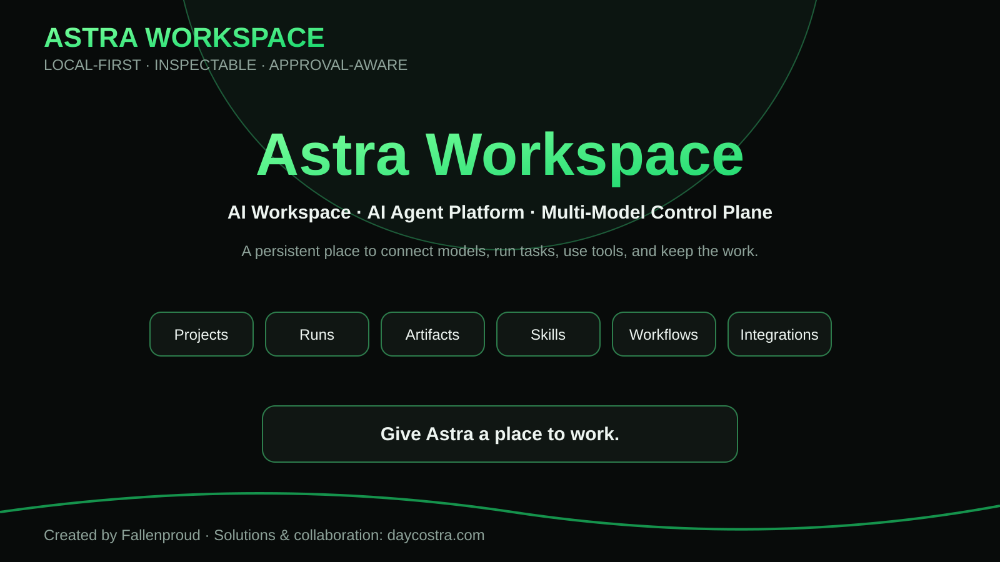
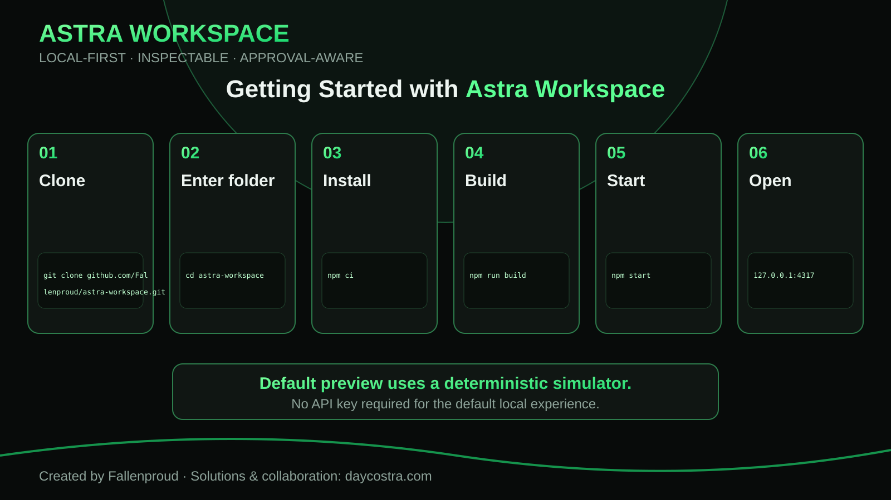
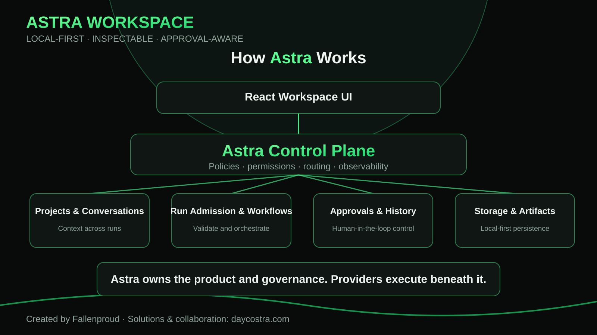
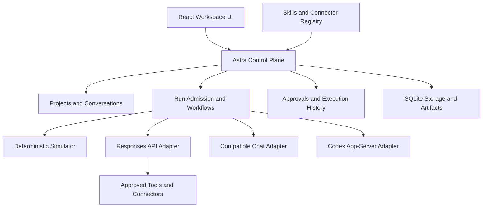
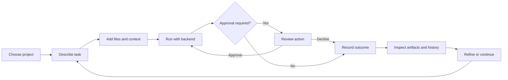
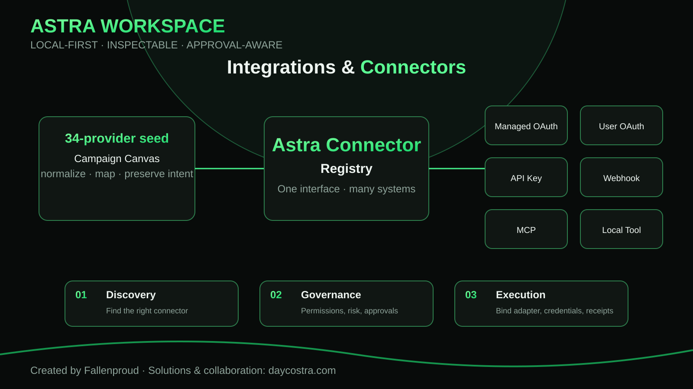
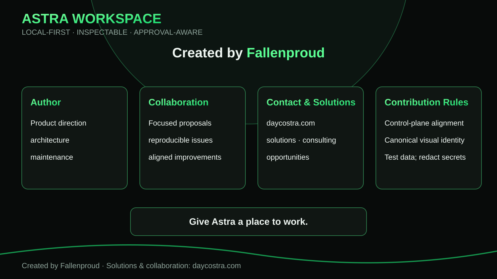

<div align="center">



# Astra Workspace

**AI Workspace · AI Agent Platform · Multi-Model Control Plane**

A persistent, local-first place to connect models, run tasks, use tools, govern actions, and keep the work.

**Created and maintained by [Fallenproud](https://github.com/Fallenproud)**  
**Solutions, collaboration & project enquiries: [daycostra.com](https://daycostra.com)**

[Get started](#get-started) · [How Astra works](#how-astra-works) · [Workspace surfaces](#workspace-surfaces) · [Integrations](#integrations--connectors) · [Development](#development--execution-modes) · [Contributing](#author-collaboration--contributions)

</div>

---

## What Astra is

Astra is an operational AI workspace built around one core idea: **AI work should have a durable place to live.** Projects, conversations, runs, approvals, artifacts, skills, workflows, model settings, and execution history belong to one inspectable environment instead of being scattered across isolated prompts and transient sessions.

Astra owns the **control plane**. Models, coding agents, tools, connectors, and execution providers operate beneath it through explicit adapters and governed boundaries.

> **Current release status:** local development preview. The default experience uses a deterministic simulator and does not require real provider credentials. Hosted registration, team access, and a public production service are not currently claimed as implemented.

### Product principles

| Principle | Meaning |
| --- | --- |
| **Local-first** | Development state, histories, projects, artifacts, and runtime data remain local unless an explicit provider or connector is configured. |
| **Inspectable** | Runs, approvals, tool activity, artifacts, and outcomes are visible instead of hidden behind opaque execution. |
| **Approval-aware** | Side effects can be gated through explicit human review and execution policy. |
| **Provider-independent** | Astra owns orchestration; model and execution providers are replaceable adapters. |
| **Persistent** | Work survives beyond a single prompt or session and remains attached to its project context. |
| **Extensible** | Skills, workflows, tools, model providers, MCP endpoints, and connector adapters can be added without redefining the control plane. |

---

## Get started



### Prerequisites

- **Git**
- **Node.js 22.13+** with npm
- A modern browser
- No API key for the default simulator

### Clone, build, and run

```sh
git clone https://github.com/Fallenproud/astra-workspace.git
cd astra-workspace
npm ci
npm run build
npm start
```

Open **http://127.0.0.1:4317** and choose **Open workspace**.

On Windows, the bundled launcher can prepare and start the development workspace:

```powershell
.\Start-Astra.ps1
```

### Your first run

1. Open the development workspace.
2. Create or select a project.
3. Add a goal, task, files, or relevant context.
4. Start the run using the default simulator.
5. Inspect the timeline, questions, approvals, and execution events.
6. Open the resulting artifact or outcome.
7. Continue the conversation or refine the task without losing project context.

Saved development work lives in `.data-development/`. Interrupted work is recorded as interrupted rather than silently replayed.

---

## How Astra works



The workspace UI is the human operating surface. The control plane owns admission, routing, lifecycle, approvals, persistence, policy, and execution history. Execution providers perform bounded work beneath that layer.



### Architecture layers

| Layer | Current implementation |
| --- | --- |
| **Interface** | React 19, Vite, Lucide icons, locally bundled fonts |
| **Visual system** | Astra folded-A identity, obsidian surfaces, silver structure, green accents, SVG motion, lazy Three.js / GSAP |
| **Control plane** | Node.js + Express with explicit lifecycle and approval handling |
| **Persistence** | SQLite in WAL mode plus filesystem-backed artifacts/history |
| **Credentials** | Production-only encrypted vault using scrypt-derived keys and AES-256-GCM |
| **Coding execution** | Pinned Codex CLI behind an app-server protocol adapter |
| **Extensibility** | Skills, workflows, supported tools/connectors, provider adapters, and local SDK |

For ownership, contracts, lifecycle behavior, and boundaries, see [ARCHITECTURE.md](ARCHITECTURE.md).

---

## Workspace surfaces

Astra is intentionally organized around work rather than model chat alone.

| Surface | Purpose |
| --- | --- |
| **Home** | Compose tasks, attach context, and continue project conversations. |
| **Projects** | Keep goals, decisions, files, context snapshots, and related work together. |
| **Runs** | Inspect execution events, approvals, questions, outcomes, and audit exports. |
| **Artifacts** | Review and retrieve produced files and outputs. |
| **Skills** | Inspect canonical skill definitions, compatibility, and qualified runtime bindings. |
| **Workflows** | Build reusable sequential agent steps with bounded context and visible execution state. |
| **Integrations** | Configure supported provider, tool, MCP, and connector relationships in the appropriate mode. |
| **Settings** | Control models, runtime behavior, reasoning, limits, and local workspace settings. |

### Primary work loop



---

## Skills, agents & workflows

Astra consumes [Fallenproud/skill-hub-registry](https://github.com/Fallenproud/skill-hub-registry) as a canonical definition source.

**Discovery does not grant trust, installation, compatibility, or execution permission.** A skill must resolve against the current runtime and receive a qualified binding before it becomes executable.

Typical lifecycle:

1. Discover the canonical definition.
2. Inspect `SKILL.md`, metadata, dependencies, and provenance.
3. Resolve compatibility against Astra.
4. Qualify and explicitly enable a runtime binding.
5. Invoke the skill and inspect the resulting records and artifacts.

Workflows currently support **1–8 sequential steps** assigned to reusable agents. Each step gets bounded prior context and its own run scope. Failures, cancellation, approvals, and outputs remain visible.

---

## Integrations & connectors



Astra's connector direction is to normalize third-party services behind a canonical registry rather than coupling the workspace to one vendor-specific gateway.

A 34-provider integration catalog from the separate **Campaign Canvas / Marketing Campaign Hub** project is being used as a **migration seed and design reference**, not as proof that all 34 providers are already executable in Astra.

The intended connector families are:

| Connection mode | Intended role |
| --- | --- |
| **Managed OAuth** | Managed workspace/provider authentication where an approved adapter exists |
| **User OAuth** | Per-user authorization with scoped tokens and refresh lifecycle |
| **API key** | Server-side provider credential binding |
| **Webhook** | Signed inbound events and event-driven integrations |
| **MCP** | Model Context Protocol endpoints exposed through qualified runtime support |
| **Local tool** | Local executables or services bound to Astra's execution policy |

The canonical progression is **discover → register → implement adapter → configure auth → validate → enable**. A connector being listed must never imply that it is trusted, authenticated, or executable.

Current MCP support is intentionally narrower: anonymous remote HTTPS endpoints through Responses are supported; OAuth and broader connector management remain expansion work.

---

## Development & execution modes

| | Default development | Explicit local production mode |
| --- | --- | --- |
| Command | `npm start` | `npm run start:production` |
| Data directory | `.data-development/` | `.data/` |
| Generation | Deterministic simulator | Selected configured provider/backend |
| Real provider credentials | Rejected | Entered through production UI and encrypted locally |
| Purpose | Build and test without charges or secrets | Deliberate live-provider validation |

**Never place real secrets in development.** Development strips credential-like inherited environment variables and rejects credential mutation through the API.

For live local execution:

1. Stop the development server.
2. Run `npm run start:production`.
3. Configure the local credential vault.
4. Add a provider and choose the model/backend.
5. Start with a small validation task.
6. Review effective permissions and side effects before widening scope.

Live mode is a local execution configuration, **not a hosted multi-tenant deployment claim**.

Browser actions use an isolated browser context with approvals rather than your personal browser profile. If needed, install Chromium with:

```sh
npx playwright install chromium
```

---

## Persistence & recovery

- Development and production use separate Git-ignored data directories.
- Override storage with `ASTRA_DATA_DIR` using an absolute path for the intended mode.
- Stop Astra before backing up the entire data directory, including SQLite/WAL files, artifacts, and histories.
- Restore with the same production passphrase when encrypted credentials are involved.
- Workspace JSON export excludes credentials and is not a substitute for a full data-directory backup.
- Pending approvals expire on restart; unfinished runs become interrupted and require explicit continuation.

The current service binds to loopback and is designed for one local user. Do not expose the current local service as a public multi-tenant deployment.

---

## Project structure

```text
astra-workspace/
├── src/                       React workspace and isolated landing demo
├── server/                    API, control plane, adapters, vault, persistence
├── config/                    Pinned registry and workflow configuration
├── profiles/astra/            Astra skill-consumer policy and bindings
├── sdk/                       Local programmatic client
├── public/                    Canonical logos, splash assets, manifest
├── vendor/                    Pinned vendored sources and notices
├── test/                      Runtime and policy tests
├── scripts/                   Launchers, verification, browser checks
├── docs/                      Architecture, contracts, README assets
├── design/                    Visual evidence and screenshots
└── astra-brand-pack/          Canonical brand system and handoff assets
```

---

## Validation & troubleshooting

```sh
npm run build
npm test
```

Landing/browser acceptance can be exercised with:

```sh
node scripts/landing-final-qa.mjs
```

The browser script expects an installed Chrome/Chromium environment and verifies the isolated demonstration, responsive containment, reduced motion behavior, and separation from operational workspace API activity.

| Symptom | Next step |
| --- | --- |
| Local page unavailable | Start Astra from the repo root and open port `4317`. |
| UI appears stale after pull | Run `npm run build`, restart, and reload. |
| npm is unavailable on a Windows PATH | Use `node scripts/npm.mjs ci` or the bundled launcher. |
| Port conflict | Stop competing Astra/Vite processes or choose another `PORT`. |
| Skill is blocked | Inspect compatibility and qualified runtime binding. Discovery alone is insufficient. |

Do not interpret this README itself as a live CI badge or a fresh all-tests-passing assertion. Review repository acceptance evidence for the specific revision being evaluated.

---

## Documentation

| Guide | Purpose |
| --- | --- |
| [Architecture](ARCHITECTURE.md) | Backend ownership, contracts, lifecycle, limits |
| [Workspace Composer Canonical](docs/WORKSPACE-COMPOSER-CANONICAL.md) | Adaptive registered views and layout promotion |
| [Landing acceptance](docs/LANDING-PAGE-ACCEPTANCE.md) | Verified frontend scope and deferred checks |
| [Brand package](astra-brand-pack/00-START-HERE/README.md) | Canonical identity, typography, assets, handoff |
| [Local SDK](sdk/client.mjs) | Programmatic access to the local control plane |

---

## Roadmap

Near-term direction includes:

- hosted registration and a clear product-access flow;
- live-provider and writable coding-backend acceptance on supported hosts;
- additional qualified skill bindings;
- canonical connector registry and progressively qualified third-party adapters;
- expanded collaboration and deployment capabilities;
- cross-browser, real-device, performance, and accessibility review.

These are roadmap items unless separately documented as implemented and validated.

---

## Author, collaboration & contributions



### Author

**[Fallenproud](https://github.com/Fallenproud)** — creator, product direction, architecture, and maintenance of Astra Workspace.

### Collaboration & solutions

For collaboration, implementation work, architecture discussions, consulting, or related AI/software solutions, visit **[daycostra.com](https://daycostra.com)**.

Focused proposals are welcome when they improve Astra without weakening its source-of-truth boundaries.

### Contribution rules

- Keep changes aligned with **Astra's control-plane ownership**.
- Preserve the **canonical Astra visual identity** unless a deliberate brand revision is being proposed.
- Use test data and **redact credentials, tokens, account identifiers, and private content**.
- Open issues with clear reproduction steps, expected behavior, affected surface, and environment details.
- Do not present discovery as installation, compatibility, trust, or execution capability.
- Avoid coupling Astra's core architecture to one provider when an adapter boundary is appropriate.
- Keep unrelated projects and their doctrine separated unless an explicit migration or interoperability contract exists.

### License & attribution

A project-wide license has not yet been declared in this repository. Vendored components and bundled fonts retain their own license notices; those notices do not grant a blanket license to the Astra project or brand assets. Review the applicable notices before redistribution or reuse.

---

<div align="center">

### Give Astra a place to work.

**Built by [Fallenproud](https://github.com/Fallenproud)** · **[daycostra.com](https://daycostra.com)** · **[Astra Workspace](https://github.com/Fallenproud/astra-workspace)**

</div>
